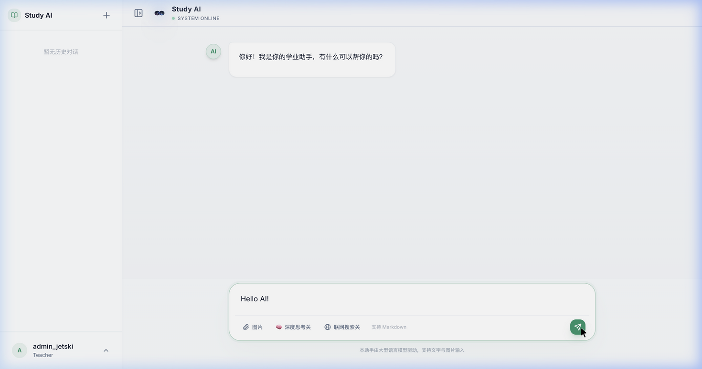
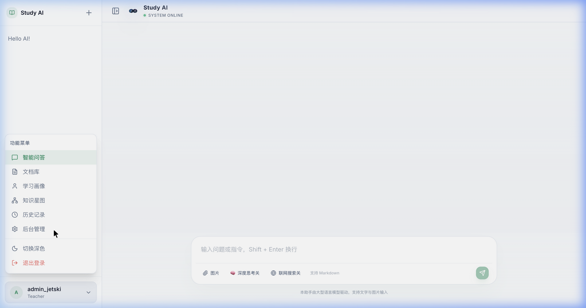
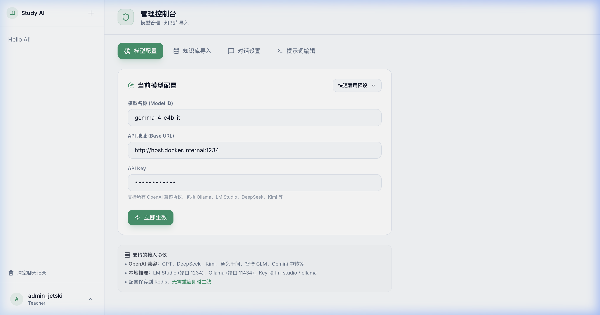

<div align="center">

<br/>


# Study AI

### 🎓 Open-Source AI Study Assistant · 开源 AI 学业辅助平台

**Self-hosted · Local LLM · RAG Knowledge Base · Web Search · Math Rendering**

<br/>

[](LICENSE)
[](https://openjdk.org/)
[](https://spring.io/projects/spring-boot)
[](https://react.dev/)
[](https://www.docker.com/)

[](https://github.com/YOUR_USERNAME/study-ai)
[](https://github.com/YOUR_USERNAME/study-ai)

<br/>

> **One command to deploy a full-featured AI tutor on your own machine.**  
> No data leaves your server. Works with local LLMs (LM Studio / Ollama) or any OpenAI-compatible cloud API.

<br/>

[English](#english) · [中文](#中文) · [Quick Start](#-quick-start) · [Screenshots](#-screenshots)

</div>

---

<a name="english"></a>

## ✨ Why Study AI?

Most AI chat interfaces are generic tools. **Study AI** is purpose-built for education:

| Feature | Study AI | ChatGPT-Next-Web | LobeChat |
|---|:---:|:---:|:---:|
| Self-hosted RAG Knowledge Base | ✅ | ❌ | ⚠️ |
| Web Search with Source Citations UI | ✅ | ❌ | ⚠️ |
| Math Formula Rendering (KaTeX) | ✅ | ❌ | ❌ |
| Deep Thinking Process Visualization | ✅ | ❌ | ❌ |
| Admin Panel (Model / Prompt / Context Config) | ✅ | ❌ | ⚠️ |
| Auto Session Title Generation | ✅ | ✅ | ✅ |
| Multimodal (Image Upload) | ✅ | ✅ | ✅ |
| One-command Docker Deploy | ✅ | ✅ | ⚠️ |
| Local LLM (Ollama / LM Studio) | ✅ | ⚠️ | ✅ |
| 100% Data Privacy (No Cloud Required) | ✅ | ❌ | ⚠️ |

---

## 🚀 Core Features

### 🧠 Deep Thinking Visualization
Parse and render the AI model's internal reasoning chain in real time. Supports native `<think>` tags and Gemma-style `<|channel>thought` tokens. The thinking process is displayed in a collapsible panel — students can see *how* the AI reasons, not just the answer.

### 📚 RAG Knowledge Base
Upload PDFs, Word docs, or plain text. The system automatically chunks, embeds (via BGE-M3 or any embedding model), and stores them in ChromaDB. Every AI answer searches your knowledge base first and cites the exact source.

### 🌐 Live Web Search + Source Citations
Toggle web search on per message. Powered by a self-hosted **SearXNG** instance — fully private, no tracking. Search results are shown as clickable reference cards with title, snippet, and URL.

### 📐 Math Formula Rendering
Full **KaTeX** support. Inline `$E=mc^2$` and block-level `$$\int_0^\infty$$` formulas render beautifully — essential for STEM subjects.

### 🛠️ Admin Control Panel
Hot-reload everything without restarting:
- Switch AI models and providers
- Edit system prompts per user role (student / teacher)
- Tune context window size (message count + character limit)
- Upload and manage knowledge base documents

### ⚡ Real-time Streaming (SSE)
Every response streams token-by-token. Multi-session isolation — switch conversations without losing streaming state. Stop generation anytime.

### 🖼️ Multimodal (Vision)
Upload an image with your question. Works with any vision-capable model (GPT-4o, LLaVA, Gemma Vision, etc.).

---

## 📸 Screenshots

<div align="center">

**Chat Interface** — Streaming answers, deep thinking panel, sidebar session management



<br/>

**Feature Toolbar** — Image upload · Deep thinking toggle · Web search toggle · Markdown support



<br/>

**Admin Panel** — Hot-reload model config, system prompts, context settings — no restart needed



</div>

---

## 🚀 Quick Start

### Prerequisites

| Service | Version | Notes |
|---|---|---|
| Docker + Docker Compose | Latest | Required |
| MySQL | 8.0+ | Run locally or use Docker |
| Redis | 6+ | Run locally or use Docker |
| LLM Server | Any | LM Studio / Ollama / OpenAI |
| ChromaDB | Latest | Only needed for RAG features |

> **Tip:** Start MySQL and Redis with Docker in 30 seconds:
> ```bash
> docker run -d --name mysql -e MYSQL_ROOT_PASSWORD=1234 -e MYSQL_DATABASE=study_ai -p 3306:3306 mysql:8.0
> docker run -d --name redis -p 6379:6379 redis:7
> docker run -d --name chroma -p 8000:8000 chromadb/chroma
> ```

### 1. Clone & Configure

```bash
git clone https://github.com/YOUR_USERNAME/study-ai.git
cd study-ai

# Copy the example config
cp .env.example .env
```

Edit `.env` with your settings (at minimum, set your DB password and AI model endpoint):

```env
# Your MySQL password
AISHOW_JDBC_PASSWORD=your_password

# Point to your LLM server (LM Studio / Ollama / OpenAI / DeepSeek)
AISHOW_AI_API_URL=http://host.docker.internal:1234   # LM Studio (local)
AISHOW_AI_MODEL=gemma-4-e4b-it                       # your model name
AISHOW_AI_API_KEY=lm-studio                          # any string for local, real key for cloud
```

> **Using OpenAI / DeepSeek / cloud APIs?**
> ```env
> AISHOW_AI_API_URL=https://api.openai.com/v1
> AISHOW_AI_MODEL=gpt-4o
> AISHOW_AI_API_KEY=sk-your-real-api-key
> ```

### 2. Create the Database Schema

```sql
-- Connect to your MySQL and run:
CREATE DATABASE IF NOT EXISTS study_ai CHARACTER SET utf8mb4 COLLATE utf8mb4_unicode_ci;
```

Then run the schema initialization (file: `src/main/resources/schema.sql` or see [Database Setup](#-database-setup)).

### 3. Launch

```bash
docker-compose up -d
```

Open **http://localhost:8090** in your browser. That's it! 🎉

---

## 🗄️ Database Setup

Run this SQL to initialize the schema:

```sql
CREATE TABLE IF NOT EXISTS `user` (
  `id` bigint NOT NULL AUTO_INCREMENT,
  `username` varchar(64) NOT NULL,
  `password` varchar(255) NOT NULL,
  `role` varchar(16) NOT NULL DEFAULT 'student',
  `create_time` datetime DEFAULT CURRENT_TIMESTAMP,
  PRIMARY KEY (`id`),
  UNIQUE KEY `uk_username` (`username`)
) ENGINE=InnoDB DEFAULT CHARSET=utf8mb4;

CREATE TABLE IF NOT EXISTS `chat_session` (
  `id` bigint NOT NULL AUTO_INCREMENT,
  `user_id` bigint NOT NULL,
  `title` varchar(100) DEFAULT '新的对话',
  `create_time` datetime DEFAULT CURRENT_TIMESTAMP,
  PRIMARY KEY (`id`)
) ENGINE=InnoDB DEFAULT CHARSET=utf8mb4;

CREATE TABLE IF NOT EXISTS `chat_message` (
  `id` bigint NOT NULL AUTO_INCREMENT,
  `session_id` bigint NOT NULL,
  `role` varchar(16) NOT NULL,
  `content` longtext NOT NULL,
  `create_time` datetime DEFAULT CURRENT_TIMESTAMP,
  PRIMARY KEY (`id`)
) ENGINE=InnoDB DEFAULT CHARSET=utf8mb4;

CREATE TABLE IF NOT EXISTS `document` (
  `id` bigint NOT NULL AUTO_INCREMENT,
  `name` varchar(255) NOT NULL,
  `content` longtext,
  `upload_time` datetime DEFAULT CURRENT_TIMESTAMP,
  PRIMARY KEY (`id`)
) ENGINE=InnoDB DEFAULT CHARSET=utf8mb4;

CREATE TABLE IF NOT EXISTS `document_chunk` (
  `id` bigint NOT NULL AUTO_INCREMENT,
  `document_id` bigint NOT NULL,
  `content` text NOT NULL,
  `chunk_index` int DEFAULT 0,
  PRIMARY KEY (`id`)
) ENGINE=InnoDB DEFAULT CHARSET=utf8mb4;

CREATE TABLE IF NOT EXISTS `document_embedding` (
  `id` bigint NOT NULL AUTO_INCREMENT,
  `chunk_id` bigint NOT NULL,
  `document_id` bigint NOT NULL,
  `chroma_id` varchar(100) DEFAULT NULL,
  PRIMARY KEY (`id`)
) ENGINE=InnoDB DEFAULT CHARSET=utf8mb4;

CREATE TABLE IF NOT EXISTS `learning_profile` (
  `id` bigint NOT NULL AUTO_INCREMENT,
  `user_id` bigint NOT NULL,
  `profile_data` longtext,
  `update_time` datetime DEFAULT CURRENT_TIMESTAMP ON UPDATE CURRENT_TIMESTAMP,
  PRIMARY KEY (`id`)
) ENGINE=InnoDB DEFAULT CHARSET=utf8mb4;

CREATE TABLE IF NOT EXISTS `user_question_log` (
  `id` bigint NOT NULL AUTO_INCREMENT,
  `user_id` bigint NOT NULL,
  `question` text,
  `create_time` datetime DEFAULT CURRENT_TIMESTAMP,
  PRIMARY KEY (`id`)
) ENGINE=InnoDB DEFAULT CHARSET=utf8mb4;

-- Default admin account: admin / admin123 (change immediately after first login)
INSERT IGNORE INTO `user` (`username`, `password`, `role`)
VALUES ('admin', '$2a$10$N.zmdr9k7uOCQb376NoUnuTJ8iAt6Z5EHsM8lE9lBpwTTyRQW9e6K', 'admin');
```

> Default credentials: **admin / admin123** — change after first login in the Admin Panel.

---

## 🔧 Configuration Reference

All configuration is done via environment variables in your `.env` file. See [`.env.example`](.env.example) for the full list with descriptions.

| Variable | Default | Description |
|---|---|---|
| `AISHOW_AI_API_URL` | `http://host.docker.internal:1234` | LLM API base URL |
| `AISHOW_AI_MODEL` | `gemma-4-e4b-it` | Model name |
| `AISHOW_AI_API_KEY` | `lm-studio` | API key (any string for local) |
| `AISHOW_AI_EMBEDDING_ENABLED` | `true` | Enable RAG knowledge base |
| `AISHOW_AI_EMBEDDING_MODEL` | `text-embedding-bge-m3` | Embedding model name |
| `AISHOW_AI_CHROMA_BASE_URL` | `http://host.docker.internal:8000/api/v2` | ChromaDB endpoint |
| `AISHOW_JDBC_URL` | _(see .env.example)_ | MySQL connection URL |
| `AISHOW_REDIS_HOST` | `host.docker.internal` | Redis host |
| `AISHOW_BACKEND_PORT` | `8090` | App port |

---

## 🏗️ Architecture

```
┌─────────────────────────────────────────────────────────┐
│                    Browser (React 18)                    │
│   Chat UI · Admin Panel · Markdown · KaTeX · SSE Client │
└───────────────────────┬─────────────────────────────────┘
                        │ HTTP / SSE
┌───────────────────────▼─────────────────────────────────┐
│              Spring Boot 3 Backend                       │
│  ┌─────────────┐  ┌──────────┐  ┌─────────────────────┐ │
│  │ ChatController│ │AdminCtrl │  │  RAG Pipeline       │ │
│  │  SSE Stream  │ │Hot-reload│  │  chunk→embed→search  │ │
│  └──────┬───────┘ └──────────┘  └──────────┬──────────┘ │
│         │                                   │            │
│  ┌──────▼───────────────────────────────────▼──────────┐ │
│  │           Spring AI  (OpenAI-compatible)             │ │
│  └──────────────────────────┬───────────────────────────┘ │
└─────────────────────────────┼───────────────────────────┘
              ┌───────────────┼───────────────┐
              ▼               ▼               ▼
        Local LLM          ChromaDB         SearXNG
    (LM Studio/Ollama)  (Vector Store)  (Web Search)
```

**Tech Stack:**

| Layer | Technology |
|---|---|
| Frontend | React 18, Vite, Tailwind CSS, shadcn/ui, Zustand, KaTeX, Framer Motion |
| Backend | Spring Boot 3.3, Spring AI, Spring WebFlux (SSE) |
| Database | MySQL 8 (MyBatis), Redis |
| Vector DB | ChromaDB (via REST API) |
| Web Search | SearXNG (self-hosted, private) |
| Deploy | Docker, Docker Compose |

---

## 🤝 Contributing

Contributions are welcome! Please:

1. Fork the repository
2. Create a feature branch: `git checkout -b feat/your-feature`
3. Commit your changes: `git commit -m 'feat: add some feature'`
4. Push to the branch: `git push origin feat/your-feature`
5. Open a Pull Request

---

## 📄 License

[MIT License](LICENSE) © 2025 Study AI Contributors

---

<a name="中文"></a>

---

<div align="center">

## 📖 中文文档

</div>

## ✨ 为什么选择 Study AI？

**Study AI** 是一款专为教育场景打造的自托管 AI 辅助学习平台。不同于通用 AI 聊天工具，Study AI 深度整合了 RAG 知识库、联网搜索、数学公式渲染和管理后台，真正做到开箱即用。

**核心优势：**
- 🔒 **数据完全私有** — 所有数据保存在你自己的服务器，支持本地大模型，不依赖任何云服务
- 📚 **RAG 知识库** — 上传文档→自动分块向量化→智能检索，AI 回答自动引用来源
- 🌐 **联网搜索** — 集成私有 SearXNG 搜索引擎，回答附带可点击的网页来源卡片
- 📐 **数学公式** — KaTeX 全支持，行内 `$...$` 和块级 `$$...$$` 完美渲染
- 🧠 **深度思考可视化** — 实时展示 AI 推理过程，折叠/展开自由控制
- 🛠️ **管理后台** — 热更新模型配置、系统提示词、上下文长度，无需重启服务

---

## 🚀 快速部署

### 前置要求

- **Docker + Docker Compose**（必须）
- **MySQL 8.0+**（本地或 Docker 启动）
- **Redis 6+**（本地或 Docker 启动）
- **大模型服务**：LM Studio / Ollama（本地）或 OpenAI / DeepSeek（云端）
- **ChromaDB**：仅 RAG 功能需要

> **30 秒启动依赖服务：**
> ```bash
> docker run -d --name mysql -e MYSQL_ROOT_PASSWORD=1234 -e MYSQL_DATABASE=study_ai -p 3306:3306 mysql:8.0
> docker run -d --name redis -p 6379:6379 redis:7
> docker run -d --name chroma -p 8000:8000 chromadb/chroma
> ```

### 第一步：克隆并配置

```bash
git clone https://github.com/YOUR_USERNAME/study-ai.git
cd study-ai
cp .env.example .env
```

编辑 `.env`，至少填写数据库密码和 AI 模型地址：

```env
AISHOW_JDBC_PASSWORD=你的MySQL密码

# 本地模型（LM Studio）
AISHOW_AI_API_URL=http://host.docker.internal:1234
AISHOW_AI_MODEL=gemma-4-e4b-it
AISHOW_AI_API_KEY=lm-studio

# 或云端 API（DeepSeek）
# AISHOW_AI_API_URL=https://api.deepseek.com/v1
# AISHOW_AI_MODEL=deepseek-chat
# AISHOW_AI_API_KEY=sk-你的真实密钥
```

### 第二步：初始化数据库

参考上方「Database Setup」部分执行 SQL 建表语句。

### 第三步：启动

```bash
docker-compose up -d
```

打开浏览器访问 **http://localhost:8090**，默认管理员账号：**admin / admin123**

---

## 🧩 功能详解

### 💬 智能对话
- **流式输出**：SSE 逐 token 推送，响应速度极快
- **多会话隔离**：随意切换对话，不丢失流式状态
- **上下文记忆**：可在管理端配置历史消息条数（默认 30 条 / 12000 字符）
- **中断生成**：随时点击「停止生成」

### 🧠 深度思考
- 支持 Gemma、DeepSeek-R1、QwQ 等具备推理能力的模型
- 实时渲染 `<think>` 思考链，可折叠展开
- 支持 LM Studio 原生 `reasoning_content` 分离输出

### 📚 RAG 知识库
1. 管理员上传文档（PDF、Word、TXT）
2. 系统自动分块、调用 Embedding 模型向量化
3. 存储到 ChromaDB
4. 用户提问时自动检索相关段落，注入 AI 上下文

### 🌐 联网搜索
- 每条消息可单独开关联网搜索
- 使用自托管 SearXNG，完全私有，不记录搜索历史
- 回答底部展示网页来源卡片（标题 + 摘要 + 链接）

### 🖼️ 图片分析
- 拖拽或点击上传图片
- 支持任意视觉模型（GPT-4o、LLaVA、Gemma Vision）
- 可用于解析数学题图片、图表分析等

### 🛠️ 管理后台
- **模型配置**：热切换 AI 模型和提供商
- **提示词编辑**：在线编辑学生端/教师端 System Prompt，保存即生效
- **对话设置**：调整历史消息数量和字符上限
- **知识库管理**：上传文档、查看向量化状态

---

## 📁 项目结构

```
study-ai/
├── src/                          # Spring Boot 后端
│   └── main/java/com/xxzd/study/
│       ├── ai/                   # AI 服务（Spring AI 封装）
│       ├── controller/           # REST + SSE 接口
│       ├── service/              # 业务逻辑（RAG、聊天、搜索）
│       ├── mapper/               # MyBatis 数据访问
│       └── config/               # 配置（AiProperties 等）
├── frontend/                     # React 18 前端
│   └── src/
│       ├── pages/                # 页面（Chat、Admin、Login）
│       ├── components/           # 组件（MarkdownRenderer、BrandLogo）
│       ├── api/                  # API 层（chat、admin、document）
│       └── store/                # Zustand 状态管理
├── ops/                          # 运维配置（SearXNG、Open-WebUI）
├── docker-compose.yml            # 一键部署配置
├── Dockerfile                    # 多阶段构建（前后端合并镜像）
└── .env.example                  # 配置模板
```

---

## 🗺️ Roadmap

- [ ] Flyway 自动数据库迁移（无需手动建表）
- [ ] 一键切换暗色/亮色主题
- [ ] 教师端作业批注模式
- [ ] 对话导出（PDF / Markdown）
- [ ] 使用统计仪表盘
- [ ] 语音输入支持
- [ ] Docker Hub 官方镜像发布

---

## 🤝 贡献

欢迎 PR 和 Issue！贡献前请先阅读 [CONTRIBUTING.md](CONTRIBUTING.md)（即将发布）。

---

<div align="center">

**如果觉得这个项目有用，请给一个 ⭐ Star — 这是对我们最大的支持！**

_If you find Study AI useful, please give it a ⭐ Star!_

[](https://star-history.com/#YOUR_USERNAME/study-ai&Date)

</div>
