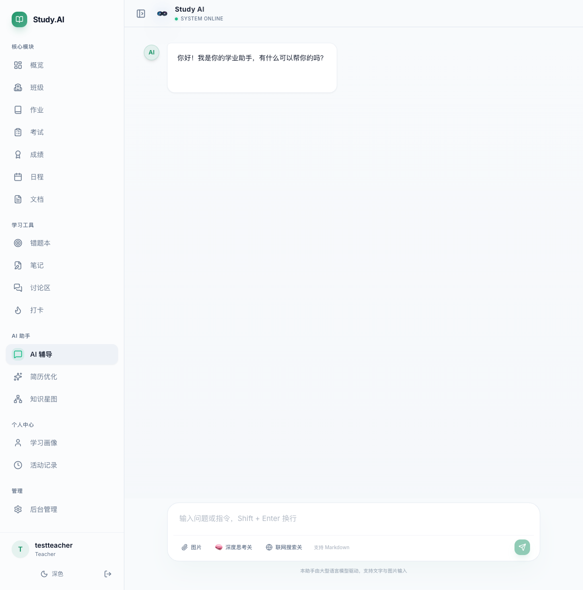
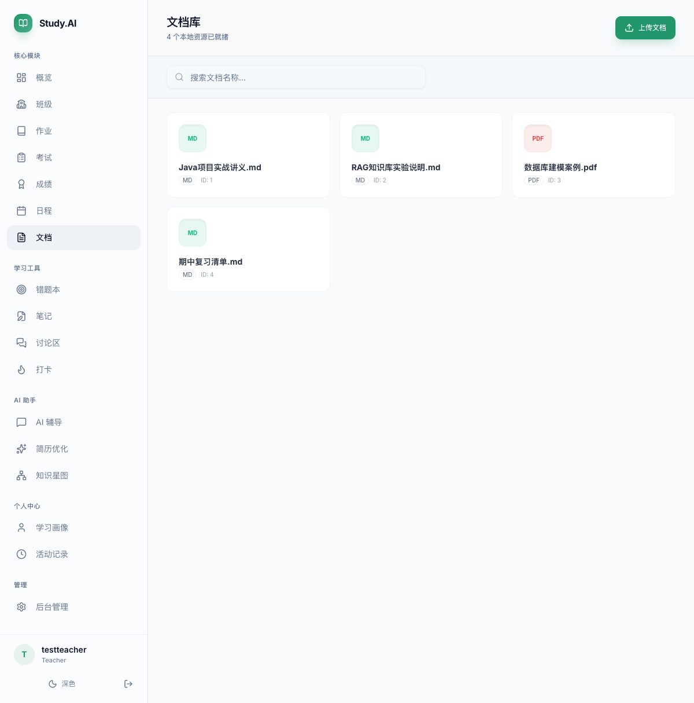
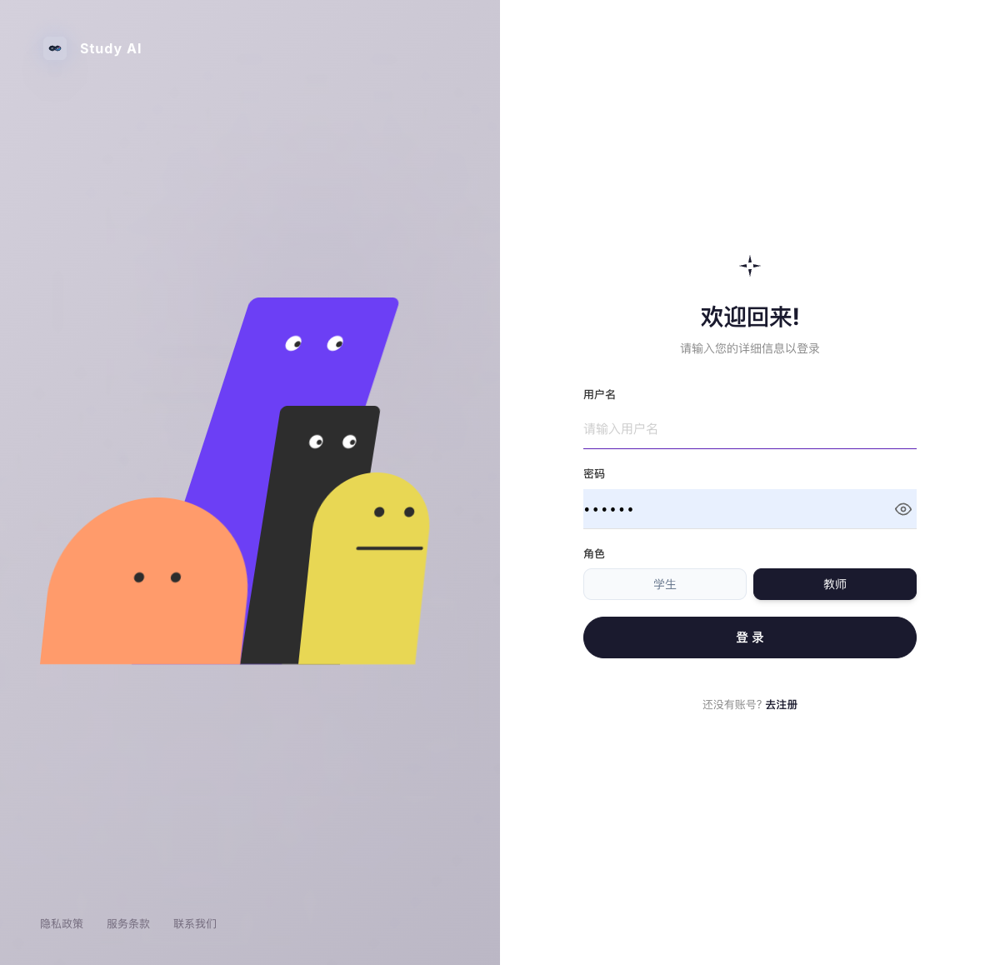
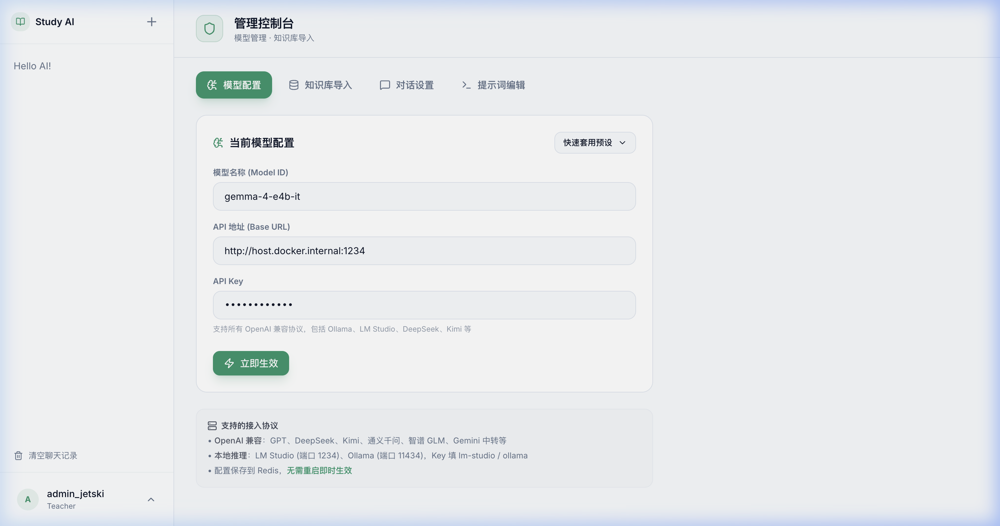
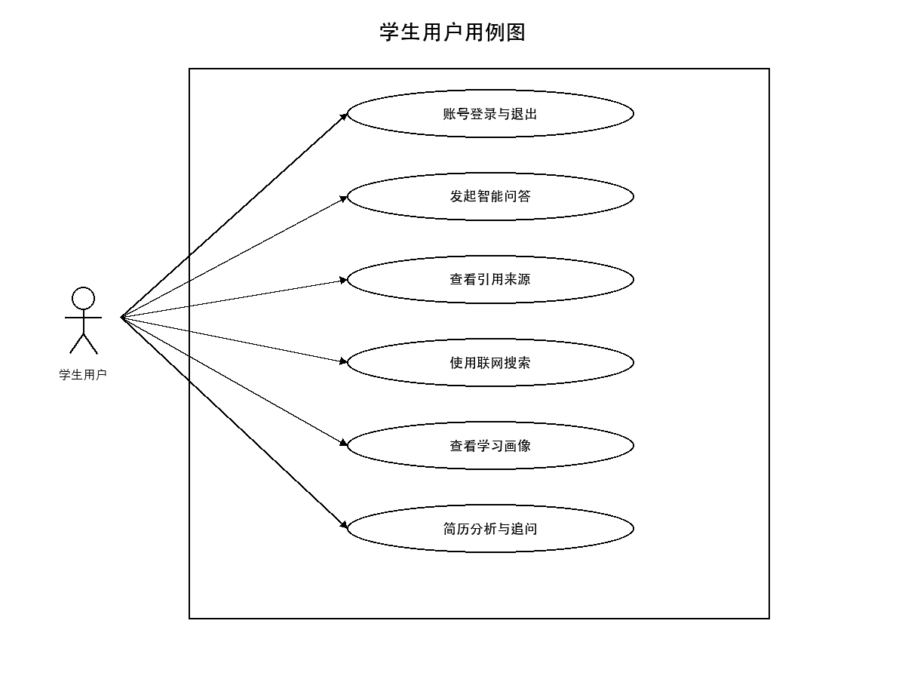
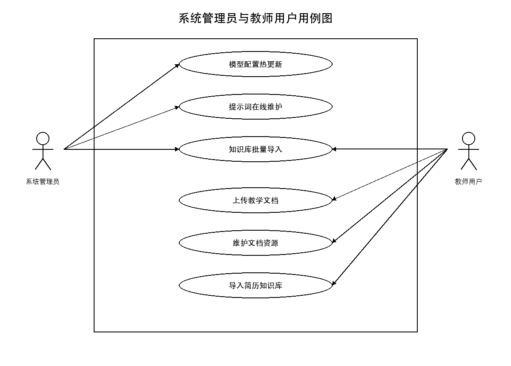

<div align="center">

<br/>


# 🎓 Study AI · 自托管全场景智能学业辅助与 RAG 知识库系统
### Enterprise-Grade Open-Source AI Study Assistant, RAG Knowledge Base & Learning Management Platform

**全功能自托管 · 100% 数据私有 · 本地大模型/云端API · RAG双路检索 · SearXNG隐私联网 · 深度思考可视化 · KaTeX公式渲染 · 知识星图 · 智能批改 · 简历学流推荐**

<br/>

[](LICENSE)
[](https://openjdk.org/)
[](https://spring.io/projects/spring-boot)
[](https://react.dev/)
[](https://www.docker.com/)
[](https://www.mysql.com/)
[](https://redis.io/)

[](https://github.com/SAKURA1175/aishow)
[](https://github.com/SAKURA1175/aishow)

<br/>

> 🚀 **专为高校教学、个人学业辅导与科研知识检索打造的一站式开源 AI 解决方案。**  
> 零数据泄露风险，支持本地大模型（LM Studio / Ollama / LocalAI）与云端主流 API（DeepSeek / OpenAI / Qwen / Claude）。

<br/>

[📖 平台概述](#-平台概述) · [✨ 18大核心功能全景](#-18大核心功能全景拆解) · [📸 各种功能截图页面](#-各种功能截图页面与架构图全景展示) · [🏗️ 技术架构选型](#-技术架构与选型) · [🚀 快速部署](#-快速部署指南) · [🗄️ 完整数据库 SQL](#-完整数据库建表-sql) · [🔌 核心 API 总结](#-核心-api-接口总结)

</div>

---

<a name="平台概述"></a>

## 📖 平台概述 (System Overview)

**Study AI** 是一款基于 **Spring Boot 3.3 + Spring AI + React 18 + Vite** 开发的开源企业级、自托管智能学业辅助与 RAG 知识库系统。

在传统通用 AI 聊天软件（如 ChatGPT、Next Web、LobeChat）中，往往缺少针对教育场景的深度功能：例如数学公式解析乱码、知识库缺失精准切片与引用追溯、缺少班级作业与考试批改联动、无法分析学生掌握度画像等。

**Study AI** 从底层架构到前端 UI 进行了全方位的教育场景定制，集成了 **SSE 流式对话**、**RAG 向量知识库检索**、**SearXNG 隐私联网搜索**、**`<think>` 深度思考推理链可视化**、**D3 知识星图**、**智能作业批改**、**简历匹配与学习流引擎** 以及 **管理员热更新控制台**，提供真正的开箱即用体验。

---

### 🆚 竞品与通用 AI 软件全方位对比

| 功能维度 | 🎓 **Study AI** | ChatGPT-Next-Web | LobeChat | FastGPT / Dify |
|---|:---:|:---:|:---:|:---:|
| **教育专用 UI & 交互** | **原生深度定制** | 通用对话 UI | 通用对话 UI | 侧重工作流构建 |
| **自托管 RAG 知识库 (PDF/Word/TXT)** | ✅ **支持 (BGE-M3 + ChromaDB)** | ❌ 不支持 | ⚠️ 部分支持 | ✅ 支持 |
| **RAG 降级容灾机制 (MySQL LIKE)** | ✅ **自动降级容灾** | ❌ 无 | ❌ 无 | ❌ 无 |
| **自托管 SearXNG 隐私联网搜索** | ✅ **支持 (卡片精准渲染)** | ❌ 不支持 | ⚠️ 需要云端插件 | ⚠️ 需要复杂配置 |
| **深度思考推理链可视化 (`<think>`)** | ✅ **原生折叠面板渲染** | ❌ 不支持 | ❌ 不支持 | ⚠️ 需要自定义卡片 |
| **LaTeX / KaTeX 数学公式渲染** | ✅ **完美渲染 (行内/块级)** | ⚠️ 基础渲染 | ⚠️ 基础渲染 | ⚠️ 基础渲染 |
| **知识星图与学情画像 (`StarMap`)** | ✅ **D3 交互式树图分析** | ❌ 无 | ❌ 无 | ❌ 无 |
| **智能作业发布与 AI 自动批改** | ✅ **内置支持** | ❌ 无 | ❌ 无 | ❌ 无 |
| **在线测试与智能错题本 (`Exams`)** | ✅ **自动诊断与复习** | ❌ 无 | ❌ 无 | ❌ 无 |
| **简历分析与个人学习流引擎 (`LearningFlow`)**| ✅ **能力缺口推荐** | ❌ 无 | ❌ 无 | ❌ 无 |
| **管理后台配置热更新 (无需重启)** | ✅ **完全支持** | ❌ 无 | ⚠️ 依赖环境变量 | ⚠️ 依赖环境变量 |
| **输入安全拦截与 Prompt 注入防御** | ✅ **内置 InputSafetyFilter** | ❌ 无 | ❌ 无 | ⚠️ 需要外部 Gateway |
| **完全自托管与 100% 数据隐私** | ✅ **零数据外流** | ⚠️ 部分支持 | ⚠️ 部分支持 | ⚠️ 依赖部署规模 |

---

<a name="18大核心功能全景拆解"></a>

## ✨ 18大核心功能全景拆解

### 💬 1. 智能学业问答与 SSE 流式极速响应
- **SSE 逐 Token 长连接推送**：基于 Spring WebFlux 及 `SseEmitter` 异步推送，秒级首 Token 响应。
- **多会话并发隔离**：独立管理多个提问会话，随意切换会话不丢失当前流式渲染状态。
- **自动生成会话标题**：首轮提问完成后，后端轻量级 LLM 自动提取 4-8 字精炼标题。
- **随时中断生成**：前端提供实时「停止生成」控制，保障长文本输出的灵活性。

---

### 🧠 2. 深度思考推理链可视化 (`<think>`)
- **推理过程实时解析**：精准提取大模型输出中的 `<think>...</think>` 标签以及 Gemma/DeepSeek 规范的 `reasoning_content` token。
- **折叠式 UI 思维链面板**：在回答上方展示独立思考面板，展开可查看解题逻辑推导、数学归纳与逻辑演绎过程。

---

### 📚 3. RAG 自托管向量知识库检索
- **多格式文档解析**：利用 Apache PDFBox 与 Apache POI 解析 PDF、Word (.docx) 及 TXT 大文档。
- **滑动窗口重叠切片**：采用 500-1000 字符动态滑动窗口策略切片，保留上下文连贯性。
- **向量化与向量库存盘**：集成 BGE-M3 / OpenAI Embedding 模型与 ChromaDB REST API 存储。
- **MySQL 全文降级容灾**：当 ChromaDB 向量库离线或维护时，后端自动无缝切至 MySQL LIKE 全文检索，保障高可用。
- **精准引用卡片**：回答底部列出带相似度匹配分数的文献切片来源卡片，点击可查看引用原文。

---

### 🌐 4. SearXNG 隐私联网搜索
- **按需单条消息开关**：提问框底部提供独立的联网搜索 Toggle 开关。
- **局域网 SearXNG 隐私引擎**：自托管搜索引擎，不记录任何搜索日志，避免学术提问被第三方风控追踪。
- **网页参考来源卡片**：自动解析搜索结果，生成包含标题、摘要及原文 URL 的来源卡片。

---

### 📐 5. LaTeX / KaTeX 数学公式 & 代码块高亮
- **完整 KaTeX 支持**：支持行内公式 `$E=mc^2$` 与块级居中公式 `$$\int_0^\infty e^{-x^2} dx = \frac{\sqrt{\pi}}{2}$$`。
- **富文本代码高亮**：提供多语言代码块语法高亮、一键复制以及行号显示。

---

### 🖼️ 6. 多模态视觉图文解析 (Vision)
- **拖拽与粘贴上传**：支持将题目图片、逻辑结构图或代码截图拖入提问框。
- **多模态模型适配**：无缝对接 GPT-4o、LLaVA、Gemma Vision 等具备视觉能力的大模型，实现看图解答。

---

### 🛠️ 7. 系统管理后台与配置热更新 (Admin)
- **模型 Endpoint 热切换**：在 Web 界面实时修改 API URL、API Key 与 Model 名称，无需重启后端服务。
- **System Prompt 在线调优**：分别在线编辑学生端与教师端的系统角色提示词。
- **上下文记忆参数微调**：自由配置历史消息携带条数上限（如 30 条）与字符总数限制（如 12000 字）。

---

### 🌌 8. 知识星图与 D3 学习画像 (`StarMap` & `Profile`)
- **提问历史主题分类**：后端 `TopicClassifier` 自动分析学生提问历史，提取学科知识点。
- **D3 交互式树图**：前端采用 D3.js 渲染直观的学科知识树与能力星图。
- **弱项诊断与建议**：计算学生在各学科板块的掌握度得分，生成针对性复习指导。

---

### 📄 9. 简历匹配与学习流引擎 (`Resume` & `LearningFlow`)
- **个人简历解析**：上传个人简历（Markdown / PDF / Word），抽取已有技能栈与经历。
- **岗位技能 Gap 分析**：对比目标岗位或研究方向，量化计算知识短板。
- **个性化学习路径推荐**：学习流引擎动态生成阶段性学习计划与资料推荐。

---

### 📝 10. 智能作业发布与 AI 自动批改 (`Assignments`)
- **教师端发布作业**：设置作业截止时间、评分标准与参考答案。
- **学生端在线提交**：支持输入文本或上传作业附件。
- **AI 智能预批注**：调用 AI 对学生提交的作业进行语法纠错、逻辑点评与预打分，辅助教师高效批改。

---

### ✍️ 11. 在线测试与防错题本 (`Exams` & `WrongQuestions`)
- **在线考试引擎**：支持单选、多选、填空与简答题，在线倒计时答题。
- **智能错题归纳**：答错题目自动加入个人「错题本」，AI 生成诊断分析与变式题练习。

---

### 📓 12. 智能笔记本与会话一键转笔记 (`Notes`)
- **学业笔记管理器**：支持 Markdown 格式笔记的创建、编辑与分类标签。
- **对话一键提炼**：将优质 AI 问答对话一键转换为整理好的学业笔记。

---

### 🏫 13. 班级与课程管理 (`Classes`)
- **班级创建与加入**：教师创建班级生成邀请码，学生一键加入。
- **课程资料共享**：班级专属知识库管理，绑定指定课程资料。

---

### 📈 14. 成绩分析与学情统计 (`Grades`)
- **成绩趋势图表**：可视化展示学生历次考试与作业的分数变化曲线。
- **班级成绩分布**：教师端查看班级最高分、平均分、及格率与分段直方图。

---

### 📅 15. 待办事项与日程规划 (`Schedule`)
- **学业任务 Kanban**：管理每日学习待办 (`Todo`) 与考试/大作业倒计时。
- **日程提醒**：支持设置事件优先级与完成状态追踪。

---

### 🏅 16. 每日打卡与学习激励 (`Checkin`)
- **连续打卡追踪**：记录学生每日学习时长与提问打卡情况。
- **学习勋章与打卡日历**：前端呈现打卡热力图，提升学习主动性。

---

### 💬 17. 互动学业社区与问答论坛 (`Forum`)
- **师生 Q&A 论坛**：学生发布悬赏提问，教师与其他同学进行回答互动。
- **AI 助手辅助回帖**：论坛支持一键召唤 AI 助手提供参考解答。

---

### 🛡️ 18. 安全拦截与注入防御 (`InputSafetyFilter` & RBAC)
- **Prompt 注入防御**：内置 `InputSafetyFilter`，检测并拦截恶意越狱与系统指令篡改。
- **RBAC 权限管控**：严格隔离 Student、Teacher、Admin 角色权限，保护敏感接口。

---

<a name="各种功能截图页面与架构图全景展示"></a>

## 📸 各种功能截图页面与架构图全景展示

为了在 GitHub 上完整直观展示系统的全貌，所有 13 张核心界面截图与 UML 架构图均保存在 GitHub 仓库的 [`docs/screenshots/`](docs/screenshots/) 目录中：

### 1. 🔑 统一登录与身份认证界面
系统提供安全优雅的统一登录/注册入口，支持账户密码验证、Cookie 会话维持及多角色导航。


---

### 2. 📊 学生工作台 & 平台首页
包含快捷提问面板、最近会话历史、热门课程推荐以及个人学习数据概览。


---

### 3. 💬 智能学业问答（流式响应 & 思考链 & 公式）
双栏 Chat 交互界面，实时显示 SSE 流式 Token 推送、`<think>` 折叠思考链与 KaTeX 数学公式渲染。


---

### 4. 👨‍🏫 教师 / 学术指导对话模式
切换至专业导师角色，进行深度学术论文写作指导、代码 Review 与毕业设计答疑。



---

### 5. 📚 知识库管理与 RAG 文档切片
上传教学 PDF / Word 文档，实时查看文本切片进度、向量化状态及 ChromaDB 入库指标。



---

### 6. 📝 学习任务与作业批改
展示教师发布的作业要求、学生提交状态及 AI 预批改评分点评。



---

### 7. 🛠️ 系统管理后台（模型 & Prompt 热更新）
管理员控制面板，支持在线无缝热切换底层 LLM Endpoint、API Key、角色 Prompt 及上下文长度。



---

### 8. 🌳 系统总体功能架构图
清晰展现用户管理、智能对话、知识库 RAG、学习画像与系统管理五大模块架构。


---

### 9. 🗄️ 数据库概念 E-R 图
涵盖 `user`、`chat_session`、`chat_message`、`document`、`document_chunk` 等全套物理实体关联图。


---

### 10. ⏱️ 核心业务交互时序图

#### (1) SSE 流式问答交互时序图


#### (2) RAG 知识库检索与切片入库时序图


---

### 11. 👤 系统角色用例图

| 学生角色用例图 | 管理员与教师用例图 |
|---|---|
|  |  |

---

<a name="技术架构与选型"></a>

## 🏗️ 技术架构与选型 (Architecture & Tech Stack)

### 系统分层拓扑架构图

```
┌───────────────────────────────────────────────────────────────────────────┐
│                       React 18 前端交互层 (SPA)                            │
│  ┌──────────────┐  ┌─────────────┐  ┌──────────────┐  ┌────────────────┐  │
│  │   Chat UI    │  │ Admin Panel │  │ StarMap (D3) │  │ Assignments/Ex │  │
│  │ SSE Renderer │  │ Hot-Reload  │  │ Profile Tree │  │  Grade Analytics│ │
│  └──────┬───────┘  └──────┬──────┘  └──────┬───────┘  └───────┬────────┘  │
└─────────┼─────────────────┼────────────────┼──────────────────┼───────────┘
          │ SSE Stream      │ HTTP REST      │ HTTP REST        │ HTTP REST
┌─────────▼─────────────────▼────────────────▼──────────────────▼───────────┐
│                      Spring Boot 3.3 后端核心层                           │
│  ┌───────────────────┐ ┌───────────────────┐ ┌─────────────────────────┐ │
│  │  ChatController   │ │  AdminController  │ │ Document/RagController  │ │
│  │ SseEmitter Stream │ │ Hot-Reload Config │ │ Chunk/Embedding Pipeline│ │
│  └────────┬──────────┘ └─────────┬─────────┘ └────────────┬────────────┘ │
│           │                      │                        │              │
│  ┌────────▼──────────────────────▼────────────────────────▼────────────┐ │
│  │               Spring AI (OpenAI Protocol Abstraction)               │ │
│  └───────────────────────────────┬─────────────────────────────────────┘ │
└──────────────────────────────────┼───────────────────────────────────────┘
               ┌───────────────────┼───────────────────┐
               ▼                   ▼                   ▼
        本地/云端 LLM           ChromaDB            SearXNG
    (LM Studio/Ollama/     (Vector Store)       (Private Web
      DeepSeek/OpenAI)     REST API v2            Search Engine)
```

---

### 🛠️ 技术选型全景矩阵

| 分层领域 | 核心技术/组件 | 版本/规范 | 说明与用途 |
|---|---|---|---|
| **前端框架** | React | 18.3+ | 核心 UI 渲染框架，函数式组件 + Hooks |
| **构建工具** | Vite | 5.0+ | 极速前端 HMR 模块热替换构建 |
| **状态管理** | Zustand | 4.5+ | 轻量高效全局状态管理（用户、会话、设置） |
| **UI 样式** | Tailwind CSS + shadcn/ui | 3.4+ | 响应式现代化设计系统、暗色模式 |
| **渲染引擎** | Markdown-It + KaTeX | Latest | SSE 流式 Markdown 渲染、LaTeX 数学公式高亮 |
| **图表可视化** | D3.js / Recharts | 7.0+ | 知识星图与成绩趋势动态图表 |
| **后端核心** | Spring Boot | 3.3.0 | 响应式 Web 容器与依赖注入框架 |
| **AI 接入框架**| Spring AI | 1.0.0-M1 | 统一抽象 OpenAI 兼容协议与 Prompt 模板 |
| **长连接推送** | Spring WebFlux / SseEmitter| 3.3.0 | 异步 Token 级流式 HTTP 长连接推送 |
| **持久层框架** | MyBatis + MySQL | 3.5+ / 8.0+| 关系型数据库操作、分页与关联查询 |
| **高速缓存** | Redis | 7.0+ | Token 鉴权缓存、临时分布式会话锁 |
| **向量数据库** | ChromaDB | 0.4+ | BGE-M3 高维向量存盘与相似度检索 |
| **隐私搜索引擎**| SearXNG | Latest | 局域网自托管搜索引擎，零隐私泄露 |
| **文档解析** | Apache PDFBox + Apache POI| 3.0+ / 5.2+| PDF / Word 文档提取与格式化切片 |
| **容器化** | Docker & Docker Compose | 24.0+ | 多阶段联合打包构建与一键式部署 |

---

<a name="快速部署指南"></a>

## 🚀 快速部署指南 (Quick Start)

### 选项 A：使用 Docker Compose 一键启动 (强烈推荐)

#### 1. 克隆项目仓库
```bash
git clone https://github.com/SAKURA1175/aishow.git
cd aishow
```

#### 2. 配置环境变量 `.env`
复制配置模板并编辑：
```bash
cp .env.example .env
```

修改 `.env` 中的核心参数（以连接本地 LM Studio 为例）：
```env
# MySQL 数据库配置
AISHOW_JDBC_URL=jdbc:mysql://host.docker.internal:3306/study_ai?useUnicode=true&characterEncoding=utf8&useSSL=false&serverTimezone=Asia/Shanghai
AISHOW_JDBC_USERNAME=root
AISHOW_JDBC_PASSWORD=your_mysql_password

# Redis 高速缓存配置
AISHOW_REDIS_HOST=host.docker.internal
AISHOW_REDIS_PORT=6379

# 大模型 Endpoint (本地 LM Studio 示例)
AISHOW_AI_API_URL=http://host.docker.internal:1234
AISHOW_AI_MODEL=gemma-4-e4b-it
AISHOW_AI_API_KEY=lm-studio

# 若使用 DeepSeek 云端 API：
# AISHOW_AI_API_URL=https://api.deepseek.com/v1
# AISHOW_AI_MODEL=deepseek-chat
# AISHOW_AI_API_KEY=sk-xxxxxxxxxxxxxxxxxxxxxxxx
```

#### 3. 极速一键构建与启动
```bash
docker-compose up -d --build
```
启动成功后，浏览器访问 **`http://localhost:8090`** 即可进入系统。

> 🔑 **默认管理员账号**：`admin`  
> 🔑 **默认管理员密码**：`admin123` *(请在首次登录后于管理后台修改)*

---

### 选项 B：本地开发与调试模式 (Development Mode)

#### 1. 启动依赖环境 (MySQL + Redis + ChromaDB)
使用 Docker 快速启动基础依赖服务：
```bash
# 启动 MySQL 8.0
docker run -d --name mysql-study -e MYSQL_ROOT_PASSWORD=1234 -e MYSQL_DATABASE=study_ai -p 3306:3306 mysql:8.0

# 启动 Redis 7.0
docker run -d --name redis-study -p 6379:6379 redis:7.0

# 启动 ChromaDB 向量库
docker run -d --name chroma-study -p 8000:8000 chromadb/chroma:latest
```

#### 2. 初始化数据库表结构
执行下方 [数据库建表 SQL](#-完整数据库建表-sql) 节中的 DDL 脚本。

#### 3. 运行后端服务 (Spring Boot)
```bash
# 编译并运行后端
mvn clean package -DskipTests
java -jar target/study-ai-backend.jar
```
后端服务运行在 **`http://localhost:8090`**。

#### 4. 运行前端工程 (React 18 + Vite)
```bash
cd frontend
npm install
npm run dev
```
前端开发服务运行在 **`http://localhost:5173`**，跨域请求会自动代理至后端 8090 端口。

---

<a name="完整数据库建表-sql"></a>

## 🗄️ 完整数据库建表 SQL

系统支持自动初始化。如需手动建立 MySQL 物理表结构，请在 `study_ai` 数据库中执行以下完整的 SQL 语句：

```sql
CREATE DATABASE IF NOT EXISTS `study_ai` CHARACTER SET utf8mb4 COLLATE utf8mb4_unicode_ci;
USE `study_ai`;

-- 1. 用户基本信息与鉴权表 (user)
CREATE TABLE IF NOT EXISTS `user` (
  `id` bigint NOT NULL AUTO_INCREMENT COMMENT '主键ID',
  `username` varchar(64) NOT NULL COMMENT '用户名',
  `password` varchar(255) NOT NULL COMMENT 'BCrypt加密密码',
  `role` varchar(16) NOT NULL DEFAULT 'student' COMMENT '角色: student/teacher/admin',
  `avatar_url` varchar(500) DEFAULT NULL COMMENT '头像图片地址',
  `create_time` datetime DEFAULT CURRENT_TIMESTAMP COMMENT '创建时间',
  PRIMARY KEY (`id`),
  UNIQUE KEY `uk_username` (`username`)
) ENGINE=InnoDB DEFAULT CHARSET=utf8mb4 COMMENT='用户表';

-- 2. 对话会话表 (chat_session)
CREATE TABLE IF NOT EXISTS `chat_session` (
  `id` bigint NOT NULL AUTO_INCREMENT COMMENT '会话ID',
  `user_id` bigint NOT NULL COMMENT '所属用户ID',
  `title` varchar(100) DEFAULT '新的对话' COMMENT '会话标题',
  `create_time` datetime DEFAULT CURRENT_TIMESTAMP COMMENT '创建时间',
  PRIMARY KEY (`id`),
  KEY `idx_user_id` (`user_id`)
) ENGINE=InnoDB DEFAULT CHARSET=utf8mb4 COMMENT='对话会话表';

-- 3. 对话消息历史表 (chat_message)
CREATE TABLE IF NOT EXISTS `chat_message` (
  `id` bigint NOT NULL AUTO_INCREMENT COMMENT '消息ID',
  `session_id` bigint NOT NULL COMMENT '所属会话ID',
  `role` varchar(16) NOT NULL COMMENT '发送角色: user/assistant/system',
  `content` longtext NOT NULL COMMENT '消息文本内容',
  `create_time` datetime DEFAULT CURRENT_TIMESTAMP COMMENT '发送时间',
  PRIMARY KEY (`id`),
  KEY `idx_session_id` (`session_id`)
) ENGINE=InnoDB DEFAULT CHARSET=utf8mb4 COMMENT='对话消息表';

-- 4. 教学文档元数据表 (document)
CREATE TABLE IF NOT EXISTS `document` (
  `id` bigint NOT NULL AUTO_INCREMENT COMMENT '文档ID',
  `name` varchar(255) NOT NULL COMMENT '原始文件名',
  `content` longtext COMMENT '全文提取内容',
  `upload_time` datetime DEFAULT CURRENT_TIMESTAMP COMMENT '上传时间',
  PRIMARY KEY (`id`)
) ENGINE=InnoDB DEFAULT CHARSET=utf8mb4 COMMENT='文档元数据表';

-- 5. 文档切片明细表 (document_chunk)
CREATE TABLE IF NOT EXISTS `document_chunk` (
  `id` bigint NOT NULL AUTO_INCREMENT COMMENT '切片ID',
  `document_id` bigint NOT NULL COMMENT '所属文档ID',
  `content` text NOT NULL COMMENT '切片段落文本',
  `chunk_index` int DEFAULT '0' COMMENT '切片序号',
  PRIMARY KEY (`id`),
  KEY `idx_document_id` (`document_id`)
) ENGINE=InnoDB DEFAULT CHARSET=utf8mb4 COMMENT='文档切片表';

-- 6. 向量映射索引表 (document_embedding)
CREATE TABLE IF NOT EXISTS `document_embedding` (
  `id` bigint NOT NULL AUTO_INCREMENT COMMENT '主键ID',
  `chunk_id` bigint NOT NULL COMMENT '关联切片ID',
  `document_id` bigint NOT NULL COMMENT '关联文档ID',
  `chroma_id` varchar(100) DEFAULT NULL COMMENT 'ChromaDB向量索引ID',
  PRIMARY KEY (`id`),
  KEY `idx_chunk_id` (`chunk_id`)
) ENGINE=InnoDB DEFAULT CHARSET=utf8mb4 COMMENT='向量映射表';

-- 7. 学习画像表 (learning_profile)
CREATE TABLE IF NOT EXISTS `learning_profile` (
  `id` bigint NOT NULL AUTO_INCREMENT COMMENT '画像ID',
  `user_id` bigint NOT NULL COMMENT '用户ID',
  `profile_data` longtext COMMENT 'JSON格式的学情画像与能力分布',
  `update_time` datetime DEFAULT CURRENT_TIMESTAMP ON UPDATE CURRENT_TIMESTAMP COMMENT '更新时间',
  PRIMARY KEY (`id`),
  UNIQUE KEY `uk_user_id` (`user_id`)
) ENGINE=InnoDB DEFAULT CHARSET=utf8mb4 COMMENT='学习画像表';

-- 8. 提问日志表 (user_question_log)
CREATE TABLE IF NOT EXISTS `user_question_log` (
  `id` bigint NOT NULL AUTO_INCREMENT COMMENT '日志ID',
  `user_id` bigint NOT NULL COMMENT '用户ID',
  `question` text COMMENT '提问内容',
  `create_time` datetime DEFAULT CURRENT_TIMESTAMP COMMENT '提问时间',
  PRIMARY KEY (`id`),
  KEY `idx_user_id` (`user_id`)
) ENGINE=InnoDB DEFAULT CHARSET=utf8mb4 COMMENT='提问日志表';

-- 9. 作业信息表 (assignment)
CREATE TABLE IF NOT EXISTS `assignment` (
  `id` bigint NOT NULL AUTO_INCREMENT COMMENT '作业ID',
  `title` varchar(200) NOT NULL COMMENT '作业标题',
  `description` text COMMENT '作业要求说明',
  `due_date` datetime DEFAULT NULL COMMENT '截止时间',
  `creator_id` bigint NOT NULL COMMENT '发布教师ID',
  `create_time` datetime DEFAULT CURRENT_TIMESTAMP COMMENT '创建时间',
  PRIMARY KEY (`id`)
) ENGINE=InnoDB DEFAULT CHARSET=utf8mb4 COMMENT='作业表';

-- 10. 作业提交与批改表 (assignment_submission)
CREATE TABLE IF NOT EXISTS `assignment_submission` (
  `id` bigint NOT NULL AUTO_INCREMENT COMMENT '提交ID',
  `assignment_id` bigint NOT NULL COMMENT '作业ID',
  `student_id` bigint NOT NULL COMMENT '学生ID',
  `content` text COMMENT '提交答案文本',
  `attachment_url` varchar(500) DEFAULT NULL COMMENT '附件下载地址',
  `score` decimal(5,2) DEFAULT NULL COMMENT '得分',
  `ai_feedback` text COMMENT 'AI预批改点评',
  `submit_time` datetime DEFAULT CURRENT_TIMESTAMP COMMENT '提交时间',
  PRIMARY KEY (`id`),
  KEY `idx_assignment_student` (`assignment_id`, `student_id`)
) ENGINE=InnoDB DEFAULT CHARSET=utf8mb4 COMMENT='作业提交表';

-- 11. 在线考试表 (exam)
CREATE TABLE IF NOT EXISTS `exam` (
  `id` bigint NOT NULL AUTO_INCREMENT COMMENT '考试ID',
  `title` varchar(200) NOT NULL COMMENT '试卷名称',
  `duration_minutes` int DEFAULT '60' COMMENT '考试时长(分钟)',
  `total_score` int DEFAULT '100' COMMENT '总分',
  `create_time` datetime DEFAULT CURRENT_TIMESTAMP COMMENT '创建时间',
  PRIMARY KEY (`id`)
) ENGINE=InnoDB DEFAULT CHARSET=utf8mb4 COMMENT='考试试卷表';

-- 12. 错题本记录表 (wrong_question)
CREATE TABLE IF NOT EXISTS `wrong_question` (
  `id` bigint NOT NULL AUTO_INCREMENT COMMENT '错题ID',
  `user_id` bigint NOT NULL COMMENT '学生ID',
  `question_text` text NOT NULL COMMENT '题目内容',
  `wrong_answer` text COMMENT '错误答案',
  `correct_answer` text COMMENT '正确答案',
  `analysis` text COMMENT 'AI生成的错题诊断与解析',
  `review_count` int DEFAULT '0' COMMENT '复习次数',
  `create_time` datetime DEFAULT CURRENT_TIMESTAMP COMMENT '记录时间',
  PRIMARY KEY (`id`),
  KEY `idx_user_id` (`user_id`)
) ENGINE=InnoDB DEFAULT CHARSET=utf8mb4 COMMENT='错题本表';

-- 13. 学业笔记本表 (notebook)
CREATE TABLE IF NOT EXISTS `notebook` (
  `id` bigint NOT NULL AUTO_INCREMENT COMMENT '笔记ID',
  `user_id` bigint NOT NULL COMMENT '用户ID',
  `title` varchar(200) NOT NULL COMMENT '笔记标题',
  `content` longtext COMMENT 'Markdown格式笔记内容',
  `tags` varchar(255) DEFAULT NULL COMMENT '标签列表',
  `update_time` datetime DEFAULT CURRENT_TIMESTAMP ON UPDATE CURRENT_TIMESTAMP COMMENT '更新时间',
  PRIMARY KEY (`id`),
  KEY `idx_user_id` (`user_id`)
) ENGINE=InnoDB DEFAULT CHARSET=utf8mb4 COMMENT='笔记本表';

-- 14. 每日打卡记录表 (checkin)
CREATE TABLE IF NOT EXISTS `checkin` (
  `id` bigint NOT NULL AUTO_INCREMENT COMMENT '打卡ID',
  `user_id` bigint NOT NULL COMMENT '用户ID',
  `checkin_date` date NOT NULL COMMENT '打卡日期',
  `study_minutes` int DEFAULT '0' COMMENT '当日学习分钟数',
  `create_time` datetime DEFAULT CURRENT_TIMESTAMP COMMENT '时间戳',
  PRIMARY KEY (`id`),
  UNIQUE KEY `uk_user_date` (`user_id`, `checkin_date`)
) ENGINE=InnoDB DEFAULT CHARSET=utf8mb4 COMMENT='每日打卡表';

-- 插入默认系统管理员账号 (admin / admin123)
INSERT IGNORE INTO `user` (`username`, `password`, `role`)
VALUES ('admin', '$2a$10$N.zmdr9k7uOCQb376NoUnuTJ8iAt6Z5EHsM8lE9lBpwTTyRQW9e6K', 'admin');
```

---

<a name="核心-api-接口总结"></a>

## 🔌 核心 API 接口总结 (API Reference)

系统底层暴露了丰富的 RESTful 接口与长连接端点，主要 Controller 如下：

| 模块控制器 | 接口基础路径 | 传输协议 | 关键功能 |
|---|---|---|---|
| `ChatController` | `/api/chat` | HTTP / **SSE** | SSE 流式问答 (`/stream`)、终止生成、生成会话标题 |
| `AdminController` | `/api/admin` | HTTP REST | 模型 Endpoint 热更新、System Prompt 在线修改、调优上下文 |
| `DocumentController` | `/api/document` | HTTP REST | 教学文档上传、自动解析切片、向量化状态与降级查询 |
| `LearningProfileController` | `/api/profile` | HTTP REST | 提问历史学科分类、D3 知识树节点数据获取 |
| `LearningFlowController` | `/api/learning-flow` | HTTP REST | 简历文本抽取、技能 Gap 匹配分析、学习路径推荐 |
| `AssignmentController` | `/api/assignments` | HTTP REST | 教师发布作业、学生提交附件、AI 智能预批注打分 |
| `ExamController` | `/api/exams` | HTTP REST | 在线测试卷调取、自动交卷判分、生成错题诊断 |
| `WrongQuestionController` | `/api/wrong-questions` | HTTP REST | 错题本添加、复习打卡、AI 变式题衍生 |
| `NotebookController` | `/api/notes` | HTTP REST | 笔记 CRUD、会话问答一键转化为笔记格式 |
| `ClassController` | `/api/classes` | HTTP REST | 班级创建、邀请码生成、班级资料共享绑定 |
| `CheckinController` | `/api/checkin` | HTTP REST | 每日学习时长打卡、热力图数据查询 |

---

## 🛠️ 运维配置与环境变量参考 (`.env`)

所有参数均可通过根目录 `.env` 文件进行无侵入配置：

| 环境变量参数 | 默认值 / 示例 | 说明 |
|---|---|---|
| `AISHOW_JDBC_URL` | `jdbc:mysql://.../study_ai` | MySQL 8.0 数据库连接 JDBC URL |
| `AISHOW_JDBC_USERNAME` | `root` | MySQL 数据库用户名 |
| `AISHOW_JDBC_PASSWORD` | `1234` | MySQL 数据库密码 |
| `AISHOW_REDIS_HOST` | `localhost` | Redis 主机 IP 地址 |
| `AISHOW_REDIS_PORT` | `6379` | Redis 服务端口号 |
| `AISHOW_AI_API_URL` | `http://localhost:1234` | LLM 基础接口 Base URL (LM Studio/OpenAI) |
| `AISHOW_AI_MODEL` | `gemma-4-e4b-it` | 大模型名称 (DeepSeek/Gemma/GPT-4o) |
| `AISHOW_AI_API_KEY` | `lm-studio` | API Key 秘钥（本地为任意字符串） |
| `AISHOW_AI_EMBEDDING_ENABLED` | `true` | 是否启用 RAG 知识库功能 |
| `AISHOW_AI_EMBEDDING_MODEL` | `text-embedding-bge-m3` | 向量化模型名称 |
| `AISHOW_AI_CHROMA_BASE_URL` | `http://localhost:8000/api/v2` | ChromaDB 向量数据库 REST API 地址 |

---

## 🗺️ 开源路线图 (Roadmap)

- [x] SSE 低延迟 Token 流式响应与中断控制
- [x] Markdown 实时解析 & KaTeX 数学公式渲染
- [x] 深度思考 `<think>` 链解析与折叠面板
- [x] BGE-M3 + ChromaDB RAG 向量知识库与降级容灾
- [x] SearXNG 自托管隐私联网搜索
- [x] 系统管理后台热更新配置 (无需重启)
- [x] 知识星图 D3 可视化与学理画像分析
- [x] 智能作业发布与 AI 预批改评分
- [x] 简历匹配与学习流引擎
- [x] 统一 Docker / Docker Compose 容器化部署方案
- [ ] Flyway 数据库自动版本迁移
- [ ] 导出对话为 PDF / Word 格式
- [ ] 语音输入 (STT) 与语音合成 (TTS)
- [ ] 兼容 Docker Hub 官方镜像发布

---

## 🤝 贡献与支持

欢迎提交 Issue 和 Pull Request！如果你觉得 **Study AI** 对你的学习、教学或科研工作有所帮助，请为本项目点亮一颗 ⭐ **Star**！

[](https://star-history.com/#SAKURA1175/aishow&Date)

---

## 📄 开源许可证

本项目基于 [MIT License](LICENSE) 开源协议发布。
